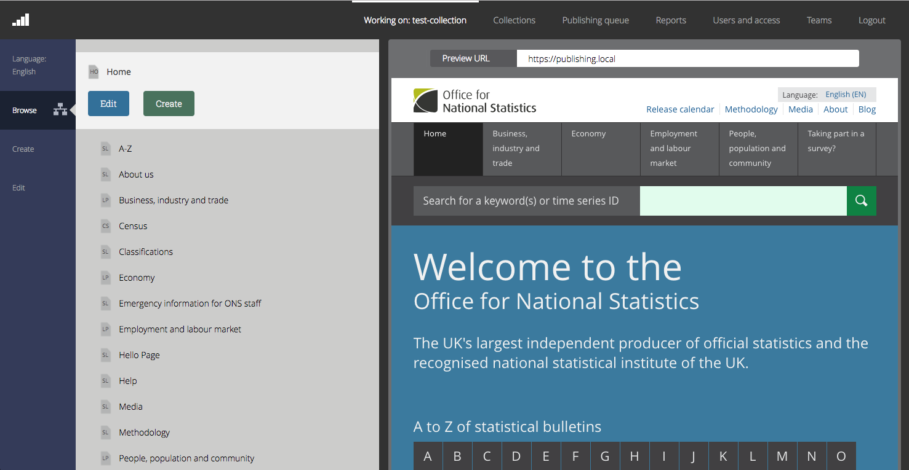

Florence
================

The publishing platform used for the [ONS website](https://www.ons.gov.uk).



### Getting started

To run Florence you must have [Golang](https://golang.org/) installed on a UNIX machine.

Once you have installed those dependencies and cloned this repo you need to run the following:

1. Move into the correct directory
```
cd florence
```
2. Run the server
```
make debug
```

Please note that encryption is enabled by default. To disable it set `ENCRYPTION_DISABLED=true`. If you wish to run with encryption
enabled, you will need vault running locally:

- Run `brew install vault`
- Run `vault server -dev`

3. Browse to the Florence homepage http://localhost:8081/florence

4. If you are running Florence for the first time you will need to login with the setup credentials. You will be asked to change this password.

Username: florence@magicroundabout.ons.gov.uk
Password: Doug4l

Further guidance on how to use Florence can be found in [usage.md](USAGE.md)

#### Dependencies

There are other ONS digital applications that you'll need to run to allow Florence to work end-to-end:

- Preview: [Babbage](https://github.com/ONSdigital/babbage)
- API: [Zebedee CMS](https://github.com/ONSdigital/zebedee)
- Preview: [Sixteens](https://github.com/ONSdigital/sixteens)
- Publishing: [The Train](https://github.com/ONSdigital/sixteens)
- Dataset upload: [Import API](https://github.com/ONSdigital/dp-import-api)
- Dataset upload: [Recipes API](https://github.com/ONSdigital/dp-recipe-api)

#### Optional (for developing Florence)

3. Install [NodeJS](https://nodejs.org/en/) and [NPM](https://www.npmjs.com/)
4. Watch for JS, CSS and other source file changes
```
make watch-src
```

### Configuration

The following environment variables are available when running the Go server.

| Environment variable  | Default                           | Description                                                                                                                              |
|-----------------------|-----------------------------------|------------------------------------------------------------------------------------------------------------------------------------------|
| BIND_ADDR             | :8080                             | Host and port to bind to. **Note**: running `make debug` will run Florence on `:8081`                                                    |
| ROUTER_URL            | http://localhost:20000            | URL that the [frontend router](https://github.com/ONSdigital/dp-frontend-router) can be accessed on                                          |
| ZEBEDEE_URL           | http://localhost:8081             | URL that [Zebedee](https://github.com/ONSdigital/zebedee) can be accessed on                                                             |
| IMPORT_API_URL        | http://localhost:21800            | URL that the [dataset import API](https://github.com/ONSdigital/dp-import-api) can be accessed on                                        |
| RECIPE_API_URL        | http://localhost:22300            | URL that the [dataset recipes API](https://github.com/ONSdigital/dp-recipe-api) can be accessed on                                       |
| TABLE_RENDERER_URL    | http://localhost:23300            | The URL that dp-table-renderer can be accessed on                                                                                        |
| UPLOAD_BUCKET_NAME    | dp-frontend-florence-file-uploads | Name of the S3 bucket that dataset uploads are sent to                                                                                   |
| ENABLE_DATASET_IMPORT | false                             | Displays the screens to allow filterable datasets to be imported through Florence (note: it requires the whole CMD stack to be running)  |

For example:
```
make debug BIND_ADDR=:20000
```

AWS configurations are needed for the dataset file upload process, so make sure the credentials are configured correctly for your environment.
```
export AWS_ACCESS_KEY_ID=<ACCESS_KEY>
export AWS_SECRET_ACCESS_KEY=<SECRET_KEY>`
```

### Contributing

See [CONTRIBUTING](CONTRIBUTING.md) for details.

### License

Copyright © 2016-2017, Office for National Statistics (https://www.ons.gov.uk)

Released under MIT license, see [LICENSE](LICENSE.md) for details.
